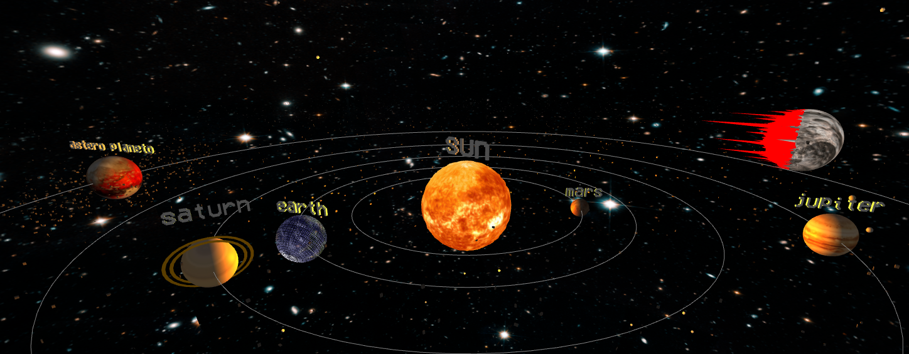
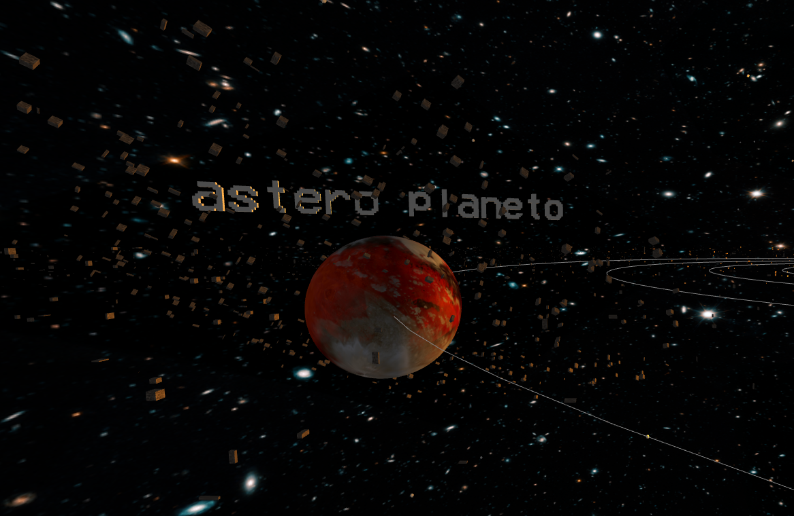
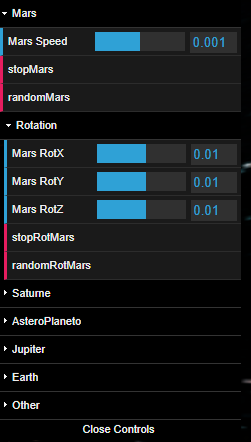

<h1 align="center"> Solar System </h1>
 

  

  

  

>## Project:
For this project we had to design a solar system using threeJS (Javascript library). Once we had the basic structure up and running we each focused on our own planets with custom textures.

Completed in the third year of my Computer Science degree at the F.S.T Limoges (France) with Yoann SOCHAJ and Benjamin MAUREL.

Class: WebGL

>## Features:
- User controlled camera
- Control menu (speed and rotations of each planet)
- Custom 3D Textures

>## Technology used:
ThreeJS: https://threejs.org/

>## Authors:
- Matt TAYLOR
- Yoann SOCHAJ [(GitHub profile)](https://github.com/YoannSo)
- Benjamin MAUREL [(GitHub profile)](https://github.com/YoannSo)

>## Final version:
v5

>## Visualise at home:
To be able to run the program at home:
1. Clone the repository
2. Launch on localhost
